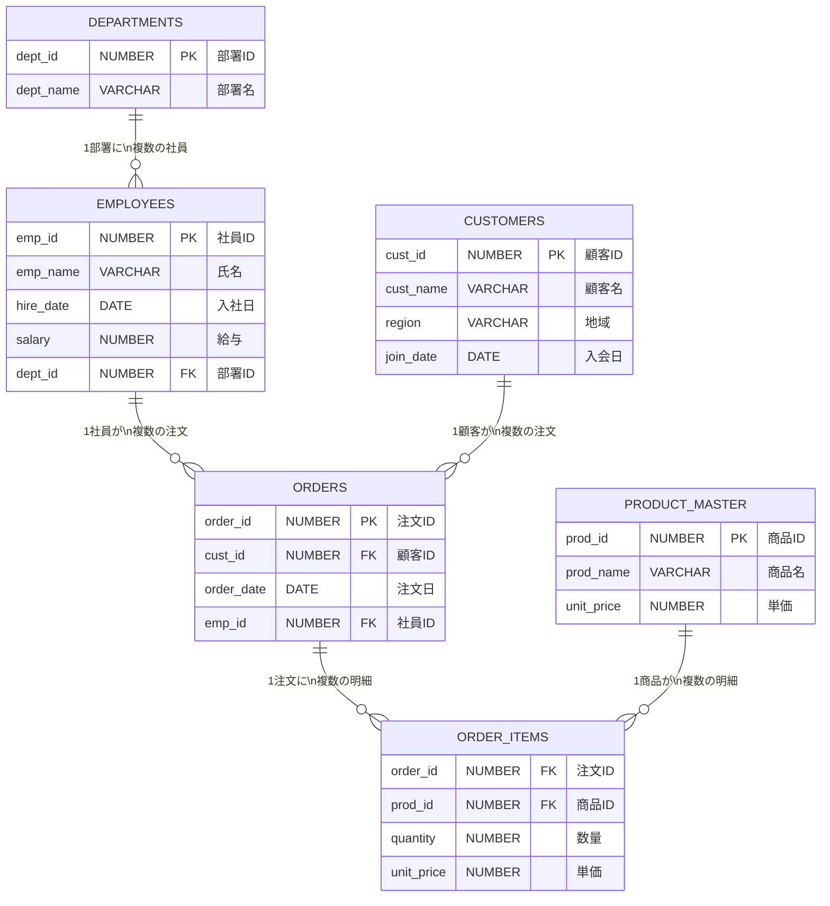

```mermaid

erDiagram
    DEPARTMENTS {
      dept_id NUMBER PK "部署ID"
      dept_name VARCHAR "部署名"
    }
    EMPLOYEES {
      emp_id NUMBER PK "社員ID"
      emp_name VARCHAR "氏名"
      hire_date DATE "入社日"
      salary NUMBER "給与"
      dept_id NUMBER FK "部署ID"
    }
    CUSTOMERS {
      cust_id NUMBER PK "顧客ID"
      cust_name VARCHAR "顧客名"
      region VARCHAR "地域"
      join_date DATE "入会日"
    }
    PRODUCT_MASTER {
      prod_id NUMBER PK "商品ID"
      prod_name VARCHAR "商品名"
      unit_price NUMBER "単価"
    }
    ORDERS {
      order_id NUMBER PK "注文ID"
      cust_id NUMBER FK "顧客ID"
      order_date DATE "注文日"
      emp_id NUMBER FK "社員ID"
    }
    ORDER_ITEMS {
      order_id NUMBER FK "注文ID"
      prod_id NUMBER FK "商品ID"
      quantity NUMBER "数量"
      unit_price NUMBER "単価"
    }

    DEPARTMENTS ||--o{ EMPLOYEES       : "1部署に\n複数の社員"
    EMPLOYEES   ||--o{ ORDERS          : "1社員が\n複数の注文"
    CUSTOMERS   ||--o{ ORDERS          : "1顧客が\n複数の注文"
    ORDERS      ||--o{ ORDER_ITEMS     : "1注文に\n複数の明細"
    PRODUCT_MASTER ||--o{ ORDER_ITEMS  : "1商品が\n複数の明細"


```
